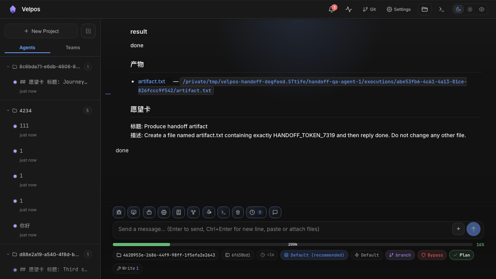

# Dogfood Report: Velpos Teams handoff

| Field | Value |
|-------|-------|
| **Date** | 2026-07-18 |
| **App URL** | http://127.0.0.1:3000 |
| **Session** | velpos-teams |
| **Scope** | Team creation, wish-card execution, multi-agent handoff |

## Summary

| Severity | Count |
|----------|-------|
| Critical | 0 |
| High | 0 |
| Medium | 1 |
| Low | 0 |
| **Total** | **1** |

## Issues

### ISSUE-001: Handoff artifact path is not an actionable file link

| Field | Value |
|-------|-------|
| **Severity** | medium |
| **Category** | functional / ux |
| **URL** | http://127.0.0.1:3000 |
| **Repro Video** | N/A — visible in the loaded handoff session |

**Description**

The second agent receives the previous Velpos session ID, Claude Code session ID,
transcript and artifact path, but `artifact.txt` is rendered as plain text. It is
not exposed as a keyboard-focusable or clickable link, so the user cannot open the
handoff artifact from the execution context. The artifact should use an application
file endpoint or an in-app file-opening action.

**Resolution**

Fixed by rendering a sanitized `file-path-link` handled by the Velpos terminal
open-path action. Verified after the fix: the browser exposes `link "artifact.txt"`
with the complete path, including paths containing spaces.

**Repro Steps**

1. Create a two-agent Team and a wish card whose first execution creates
   `artifact.txt`.
2. Wait for completion, then drag the card to the second Agent.
3. Open the second Agent's running card.
4. **Observe:** the handoff contains `artifact.txt` and its absolute path, but no
   actionable link appears.

   

---
